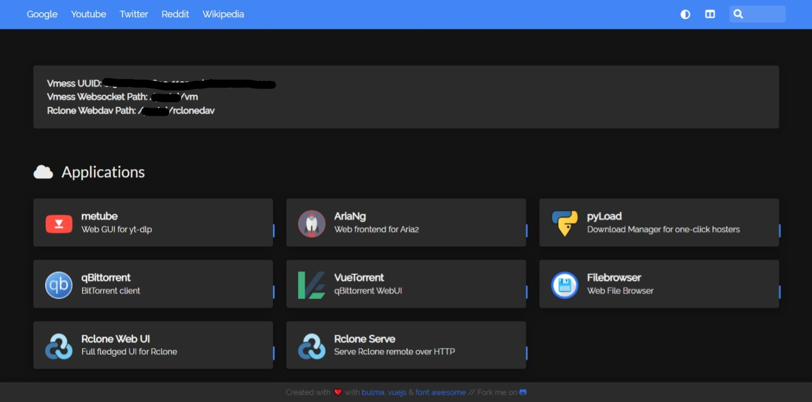
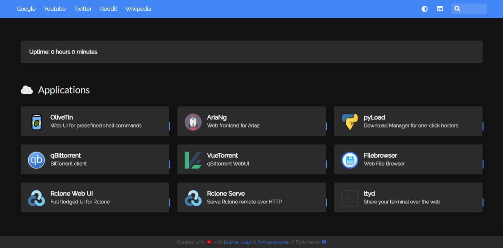
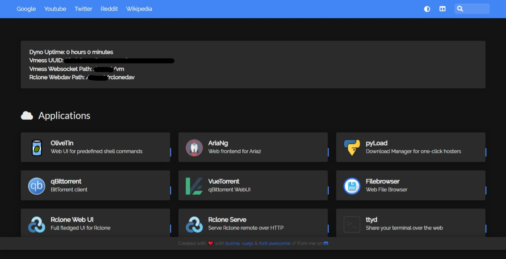
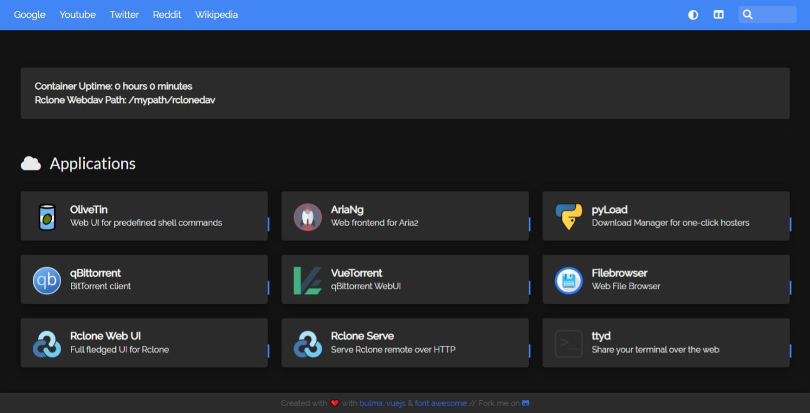

[点击前往中文说明](README_chs.md)

## Attention
 - Anyone who can login into this app has full access to data in this app and Rclone remotes. Do not share with other ppl, and do not store sensitive information with this app.

This project integrates yt-dlp, Aria2, gallery-dl, qBittorrent, pyLoad Download Manager, rclone auto-upload, Telegram notification and their WebUI plus other Web Apps into a single package which is easy to deploy.

## [Docker Deployment](docs/README_docker.md)

Screenshot

<!---## [Colab Deployment](docs/README_colab.md)

Screenshot

-->
## [Heroku Deployment](docs/README_heroku.md)

Heroku stopped offering free product plans and shut down free dynos starting Nov. 28, 2022.

Screenshot

## [Doprax Deployment](docs/README_doprax.md)

Doprax has stopped offering free plan.

Screenshot

## Acknowledgments

- [alexta69/metube](https://github.com/alexta69/metube) Simple and easy-to-use yt-dlp frontend.
- [P3TERX/aria2.conf](https://github.com/P3TERX/aria2.conf)  Rely on the Aria2 script from P3TERX to automatically trigger the Rclone upload after the Aria2 downloads completed.
- [wahyd4/aria2-ariang-docker](https://github.com/wahyd4/aria2-ariang-docker)  Inspiration for this project.
- [bastienwirtz/homer](https://github.com/bastienwirtz/homer)  A very simple static homepage for your server.
- [mayswind/AriaNg](https://github.com/mayswind/AriaNg) | [filebrowser/filebrowser](https://github.com/filebrowser/filebrowser) | [aria2/aria2](https://github.com/aria2/aria2) | [rclone/rclone](https://github.com/rclone/rclone) | [yt-dlp/yt-dlp](https://github.com/yt-dlp/yt-dlp) | [userdocs/qbittorrent-nox-static](https://github.com/userdocs/qbittorrent-nox-static) | [WDaan/VueTorrent](https://github.com/WDaan/VueTorrent) | [OliveTin/OliveTin](https://github.com/OliveTin/OliveTin) | [pyload/pyload](https://github.com/pyload/pyload) | [mikf/gallery-dl](https://github.com/mikf/gallery-dl)