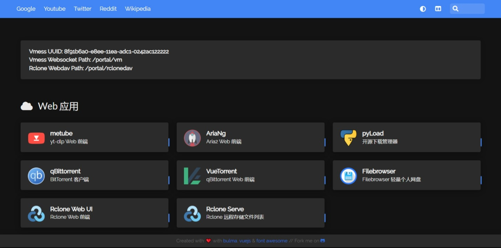
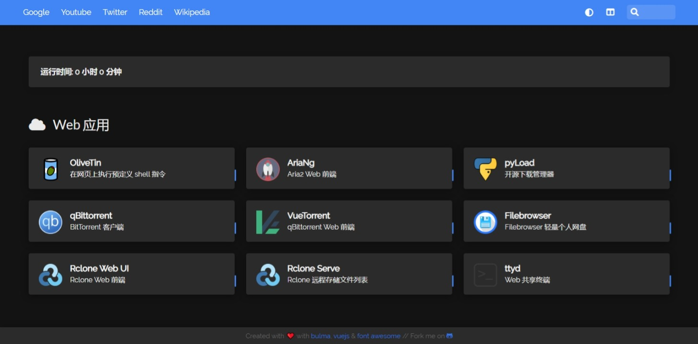
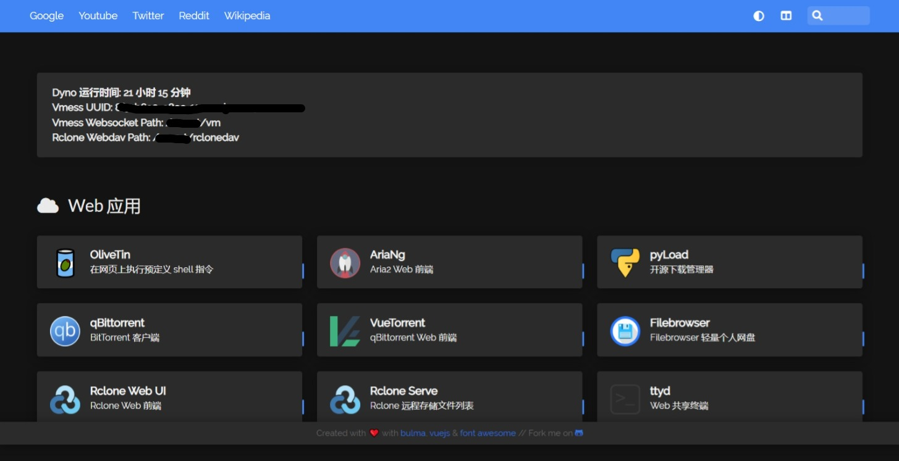
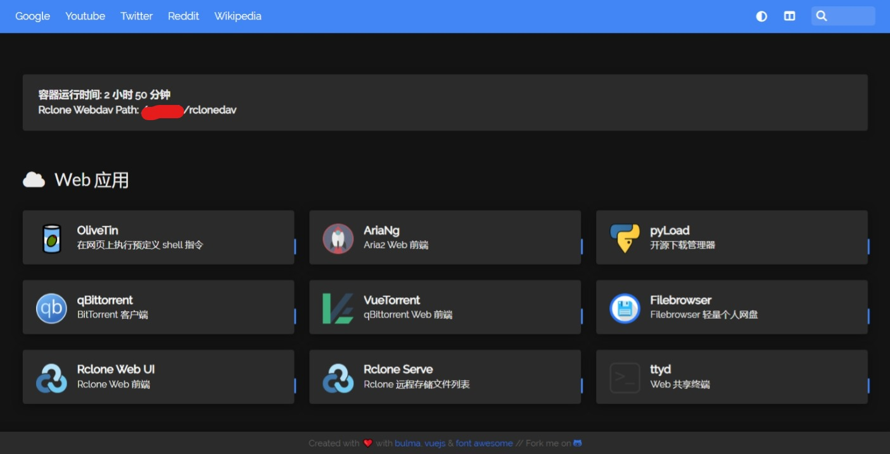

## 注意

- 所有可以登陆此APP的用户可以访问/修改此APP以及Rclone远程存储的所有数据，不要存放敏感数据，不要与他人共享使用。

本项目集成了yt-dlp、Aria2、gallery-dl、qBittorrent、pyLoad下载管理器、Rclone联动自动上传功能、Telegram任务完成通知以及它们的WebUI和更多Web应用。

## [Docker 部署](docs/README_docker_chs.md)

截图

<!---## [Colab 部署](docs/README_colab_chs.md)

截图

-->
## [Heroku 部署](docs/README_heroku_chs.md)

Heroku已于2022年11月关闭免费服务

截图

## [Doprax 部署](docs/README_doprax_chs.md)

Doprax 已停止提供免费服务

截图

## 鸣谢

- [alexta69/metube](https://github.com/alexta69/metube) 简洁好用的yt-dlp前端。
- [P3TERX/aria2.conf](https://github.com/P3TERX/aria2.conf)  依靠来自P3TERX的Aria2脚本，实现了Aria2下载完成自动触发Rclone上传。
- [wahyd4/aria2-ariang-docker](https://github.com/wahyd4/aria2-ariang-docker)  启发了本项目的总体思路。
- [bastienwirtz/homer](https://github.com/bastienwirtz/homer)  使用yaml配置文件的静态导航页，便于自定义。
- [mayswind/AriaNg](https://github.com/mayswind/AriaNg) | [filebrowser/filebrowser](https://github.com/filebrowser/filebrowser) | [aria2/aria2](https://github.com/aria2/aria2) | [rclone/rclone](https://github.com/rclone/rclone) | [yt-dlp/yt-dlp](https://github.com/yt-dlp/yt-dlp) | [userdocs/qbittorrent-nox-static](https://github.com/userdocs/qbittorrent-nox-static) | [WDaan/VueTorrent](https://github.com/WDaan/VueTorrent) | [OliveTin/OliveTin](https://github.com/OliveTin/OliveTin) | [pyload/pyload](https://github.com/pyload/pyload) | [mikf/gallery-dl](https://github.com/mikf/gallery-dl)